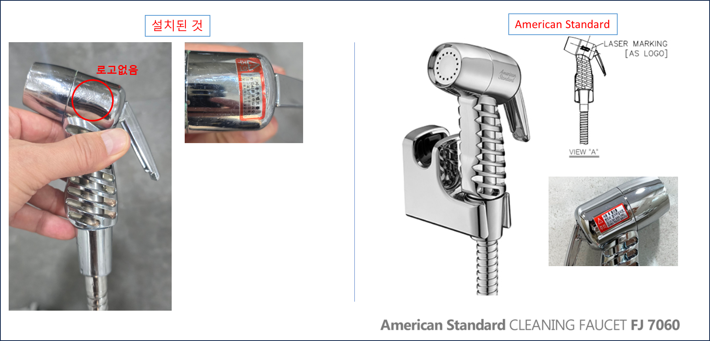
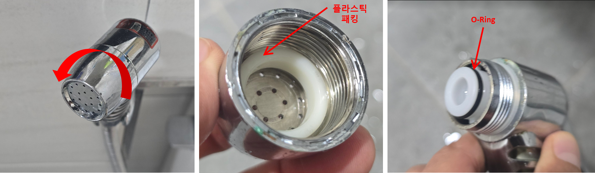
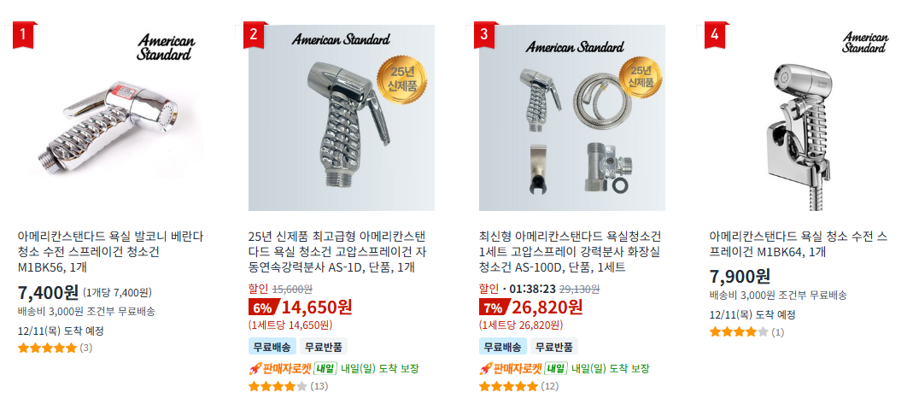
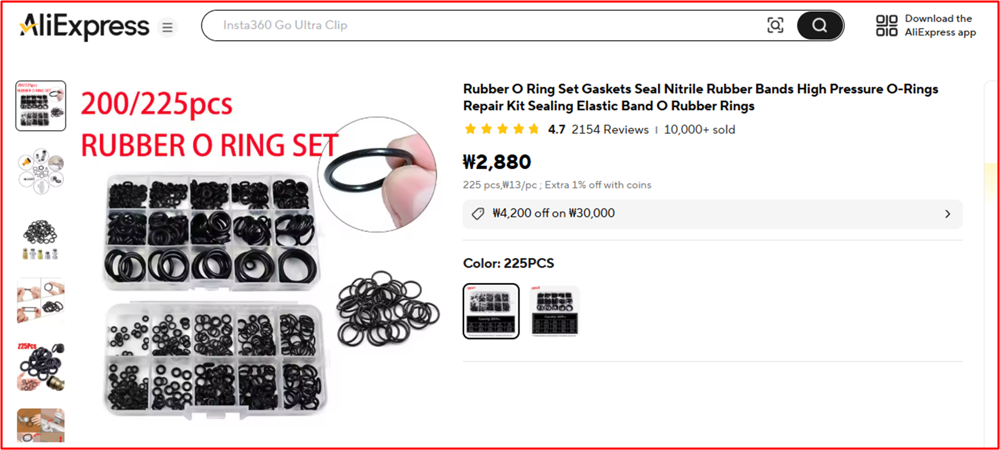

> 화장실 청소할때 쓰는 워터건 아래에 물이 흔건하게 고였다. 한번 고쳐보자. 

- 제품은 아메리칸 스탠다드 제품과 비슷하지만, 브랜드 제품은 아닌것 같다. (**레이저 각인**이 없다.)
  -  **아메리칸 스탠다드** 기준 모델명은 `FJ7060`, `M1BK56`. 
  - **플라스틱**(ABS)에 **크롬**도금으로 되어 있다.
  - 아메리칸스탠다드 정품도 ABS에 크롬도금이다. 
- 설비하시는 분이 몇천원 아끼셨나보다. 눈에 보이지 않으면 정품을 쓰는 일이 없더라.

 물이 나오는 곳에서 사용 후 한 두방울씩 떨어지며 잠근 상태에서 새는 문제가 있는 듯 하다. 

<lite-youtube videoid="JSTowgyZzHE" videotitle="화장실 워터건 수리" class="video-custom"></lite-youtube>

 분해를 해보면 안쪽에 플라스틱 패킹과 맞닿는 부분에 O-Ring이 있다.

 

 `O-Ring`이 마모되어 물이 샐 확률이 높다. 이렇게 되면

#### 새걸 사던지.
  - 새것 기준 **10,000원 ~ 15,000원** 정도

  

#### 고치던지...
  - 이런 O-Ring은 알리에서 쉽게 구할수 있다. **2,000원**..  아래를 클릭하면 이동

 구매하고 3일후에 배송되었다. 새로사는 것 보다 싸다. 
 패킹이 약간 크지만 두꺼워서 괜찮을 것 같다.

<lite-youtube videoid="Y1-V3TbYbmc" videotitle="패킹 분리 및 수리" class="video-custom"></lite-youtube>

교체를 하고 나니 물이 새지 않는다. 성공이다. 

<lite-youtube videoid="RPriELpOmxo" videotitle="화장실 워터건 수리완료" class="video-custom"></lite-youtube>

끝.