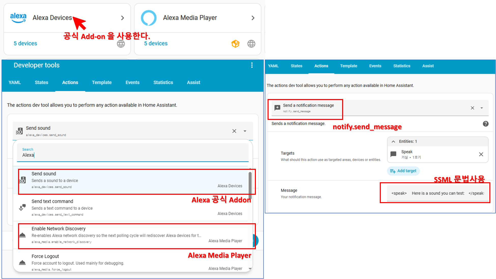

> 알렉사를 통해서 원격 또는 자동으로 집안 안내 방송을 해보자. 

 빨래를 널고 나면 베란다의 습도가 올라간다. 창문을 열어 환기를 시켜야 하는데 깜빡 잊을때가 있다.

  "베란다 습도가 높습니다. 창문을 열어주세요"

이런 것이 자동으로 모니터링되어 집에 안내 방송으로 나오면 어떨까? 간단하게는 Bluetooth 스피커를 이용하는 방법이 있겠지만, 집에 Alexa 기기가 있으니 Alexa Noti 기능을 이용해보자.

### 정보 수집

- 알렉사는 미국애다. 한국말은 서툴다.
- 알렉사는 Skill을 통해서 기능을 확장할수 있지만, 만드는 것이 쉽지 않다.
- HAOS(Home Assistant Operating System)에서는 Alexa Add-on 기능을 지원한다.
  - [Alexa Media Player](https://www.home-assistant.io/integrations/alexa_media/) 이라는 비공식 지원이 있고 
  - 알렉사 공식 Add-on도 있다.
- 알렉사에 한국말을 말하게 하려면 TTS가 아닌 Media file(MP3 등)을 재생해야한다.

### 방법 생각해보기

**HAOS**에 Alex를 연동시키고 TTS로 Alexa에게 출력하게 하면 어떨까?
  - 알렉사 자체 TTS는 영어만 지원한다. 한국말은 어색하다.
  - 한국말은 MP3으로 만들어서 미디어 출력을 하면 된다.

MP3 생성을 위한 TTS에 비용이 부담스럽다면, 특정 상황에 맞는 멘트들은 Library로 만들어두고 상황에 맞게 재생시키면 된다.

출력은 Script로 만들어두고 상황에 맞게 호출시키면 된다.

---

해보자.


---

#### [실행1] HAOS의 Alexa 관련 Add-on 설치 및 음성출력

 **HAOS**에서 알렉사 관련은 2개의 Add-on이 있는데, 다들 Alexa Media Player를 많이 쓴다. 나의 경운 공식 Add-on이 더 쉬웠다.

 알렉사에 음성 출력을 위해서는 `notify.send_message`을 쓰면 되는데, Target을 지정한 후에 메세지를 보내면된다. 단순 Text도 가능하고 복잡한 상황(MP3 출력 등)은 **SSML(Speech Synthesis Markup Language)**을 작성하면 가능하다.

HAOS의 Action의 이름에 Alexa가 없어서 조금 헷갈릴수 있는데, 아래 그림을 참고하자.



#### [실행2] Alex에 MP3 출력시켜 보기

음성출력은 다음과 같이 SSML로 작성한다.  [SSML reference]("https://developer.amazon.com/en-US/docs/alexa/custom-skills/speech-synthesis-markup-language-ssml-reference.html")

```xml
<speak>
    Welcome to Ride Hailer.
    <audio src='soundbank://soundlibrary/transportation/amzn_sfx_car_accelerate_01' />
    You can order a ride, or request a fare estimate.
    Which do you want?
</speak>
```

외부에서 HAOS로 Action을 호출하려면 API를 사용한다. 전달해야할 파라미터는 다음의 URL을 참고한다.    [Integration Notify](https://www.home-assistant.io/integrations/notify)

API 접근을 위한 Access Tokens은 **HAOS**의 사용자 프로필에서 생성할 수 있다. Target은 Alexa Device를 지정하고 Message에 SSML을 넣어주면 된다.

```shell
curl -X POST \
  -H "Authorization: Bearer 어쩌구저쩌구" \
  -H "Content-Type: application/json" \
  -d '{"entity_id": "notify.1hogi_speak", "message": "<speak>Hello This is Alexa, Nice to meet you.</speak>"}' \
  http://HAOS:8123/api/services/notify/send_message
```

MP3 재생도 동일하게 할 수 있고, MP3의 URL을 지정해주면 된다.

```shell
curl -X POST \
  -H "Authorization: Bearer 어쩌구저쩌구" \
  -H "Content-Type: application/json" \
  -d "<speak>     Welcome to Ride Hailer.     <audio src='soundbank://soundlibrary/transportation/amzn_sfx_car_accelerate_01' />     You can order a ride, or request a fare estimate.     Which do you want? </speak>" \
  http://HAOS:8123/api/services/notify/send_message
```

#### [실행3] Text to MP3 변환

한국말로 해야하니까. MP3 파일을 만들어야 한다. Alexa가 인식하는 MP3 포맷은 정해져 있어서 그 포멧을 딱 맞춰줘야했다. 

규격은 다음을 참고하자.

 Use the `<audio>` tag to embed short, pre-recorded audio within your response. For example, you could include sound effects alongside your text-to-speech responses, or provide a response that uses a voice associated with your brand.

|속성|요구 사항 / 가능 값|
|---|---|
|src|MP3 파일 URL|
|호스팅|인터넷에서 접근 가능한 HTTPS 엔드포인트, 유효한 SSL 인증서 필요 (Self-signed 불가)|
|내용 제한|고객 정보나 민감한 정보 포함 금지|
|파일 형식|유효한 MP3, MPEG 버전 2|
|오디오 길이 (응답)|단일 파일 ≤ 240초|
|총 오디오 길이 (outputSpeech)|모든 파일 합산 ≤ 240초|
|총 오디오 길이 (reprompt)|모든 파일 합산 ≤ 90초|
|비트레이트|48 kbps (음성용 최적화)|
|샘플링 레이트|16 kHz, 22.05 kHz, 24 kHz|
|변환 권장|필요 시 컨버터 소프트웨어로 MPEG 버전 2, 48 kbps 변환|

일레븐랩스의 TTS API로 MP3을 얻은후 ffmpeg로 요구사항에 맞도록 변경하게 자체 API를 만들었다. Text를 넘겨주면 MP3을 넘겨준다. 

```
curl -X POST "https://APISERVER/Alexa/TextToSpeech" \
  -H "x-api-key: SuperUltraKey-KeySequence" \
  -H "Content-Type: application/json" \
  -d '{"text": "안녕하세요. Alexa 음성 변환 예시입니다."}' \
  --output output.mp3
```

#### [실행4] 생성된 mp3을 Library로 만들기

HAOS에 `/config/www`에 MP3 파일을 올려두면 외부에서 접근이 가능하다.

 MP3 파일 URL은 `http://HAOS:8123/local/파일명.mp3`가 된다.

 출력테스트는 아래를 참고하자. 

```shell
curl -X POST \
  -H "Authorization: Bearer 어쩌구저쩌구" \
  -H "Content-Type: application/json" \
  -d '{
        "entity_id": "notify.1hogi_speak",
        "message": "<speak>  This is Alexa Sound Play Test <audio src='http://192.168.204.202:8123/local/alexa_tts/output.mp3'/> Working great? </speak>"
      }' \
  http://HAOS:8123/api/services/notify/send_message
```

### 마치면서

정리를 해보면 HAOS API를 이용해서 Alexa Add-on의 Notify 기능을 호출하였고 파라미터로 MP3이 담긴 SSML을 전송함으로써 지정한 Alexa에서 음성 출력이 나오도록 하였다. 

이제 HAOS에서 Event Trigger하거나 API를 이용해서 필요할때 호출해서 쓰면 된다.